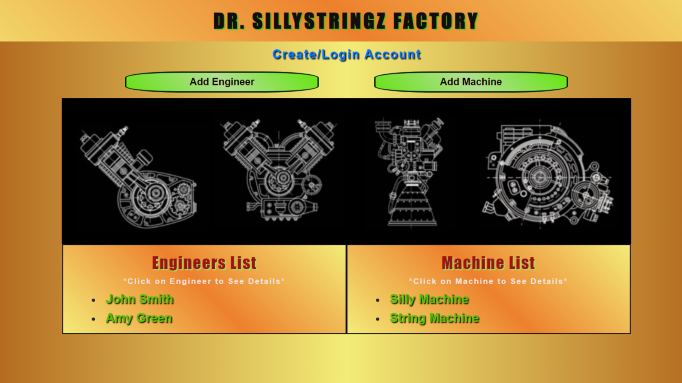

# Dr. Sillystringz Factory Authentication

#### By Sue Roberts

####  MVC web application to manage their engineers and the machines they are licensed to fix with user authentication. 

## Technologies Used

* C#
* .NET 5.0
* SQL Workbench
* Entity Framework
* ASP.NET
* REPL
* CSS
* Bootstrap
* HTML
* Identity 
* Razor

## Description

The application has user authentication. Users are able to login and logout. Only login users could create, update and delete. All users are able to read without login. The login users coould add a list of engineers, a list of machines, and specify which engineers are licensed to repair which machines. There are many-to-many relationships between Engineers and Machines. An engineer can be licensed to repair many machines and a machine can have many engineers licensed to repair it. 

## Home View


## Setup/Installation Requirements

* Clone repository: $ git clone https://github.com/SueRtx/SillyStringzProject4.Solution.git  
* Open Vs Code: $ code .   
* Open TERMINAL in Vs Code
* Go to Factory directory: $ cd Factory
* Create file at root directory: $ touch "appsettings.json"
* Add following code to "appsettings.json" (Add your own password)
```
{
  "ConnectionStrings": {
      "DefaultConnection": "Server=localhost;Port=3306;database=sun_roberts;uid=root;pwd=[YOUR-PASSWORD];"
  }
}

``` 
* Download MySQL WorkBench  
* Go to terminal  → $ dotnet restore → $ dotnet build → dotnet ef database update
* Run Program: $ dotnet run  
* Open web browser: http://localhost:5000/  

## Known Bugs

* none

## License

MIT

Copyright (c) 2022 Sue Roberts